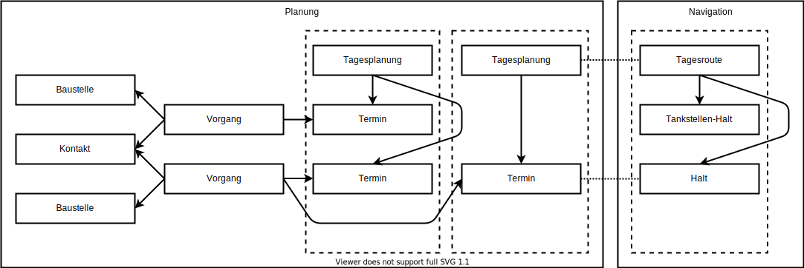
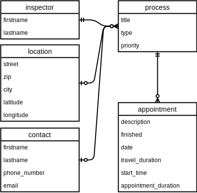
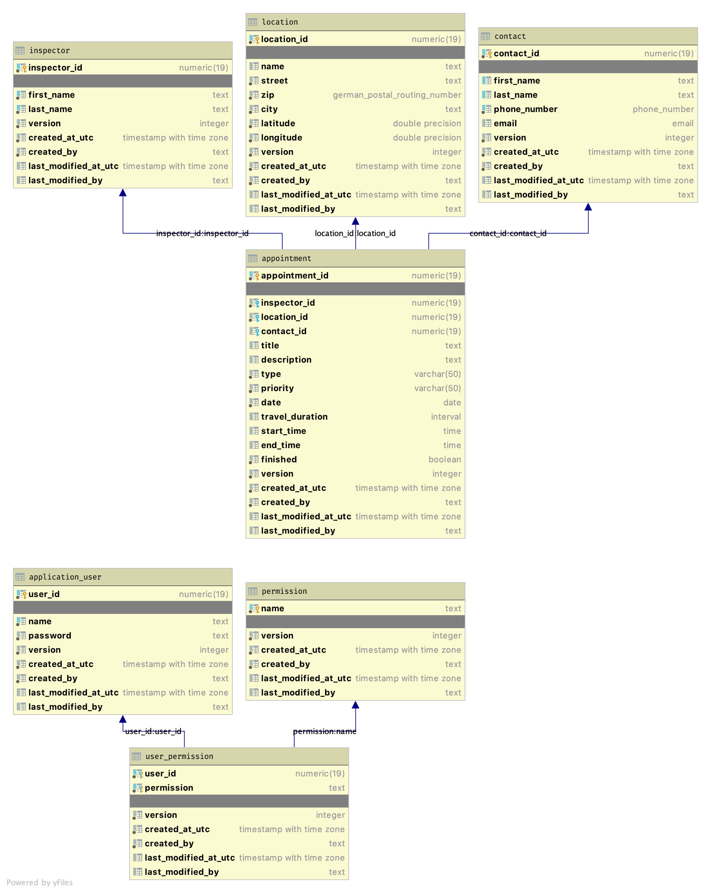
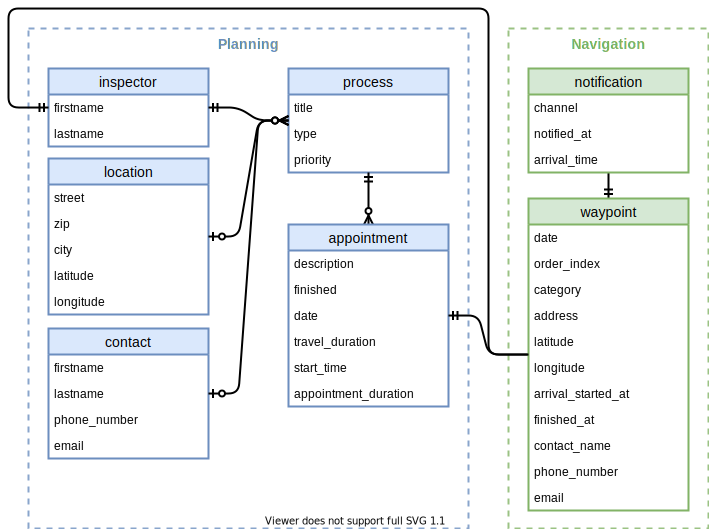
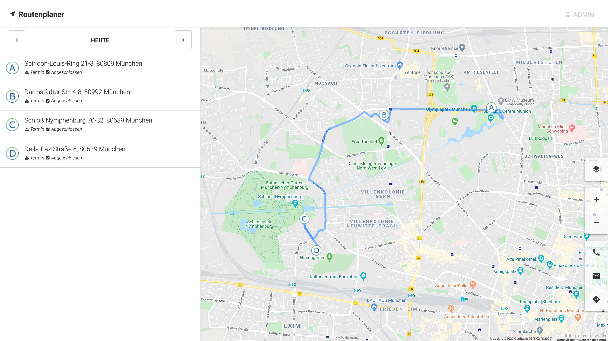
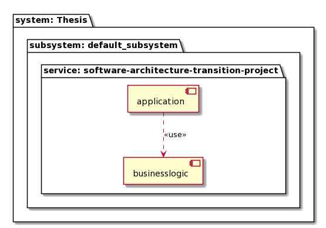
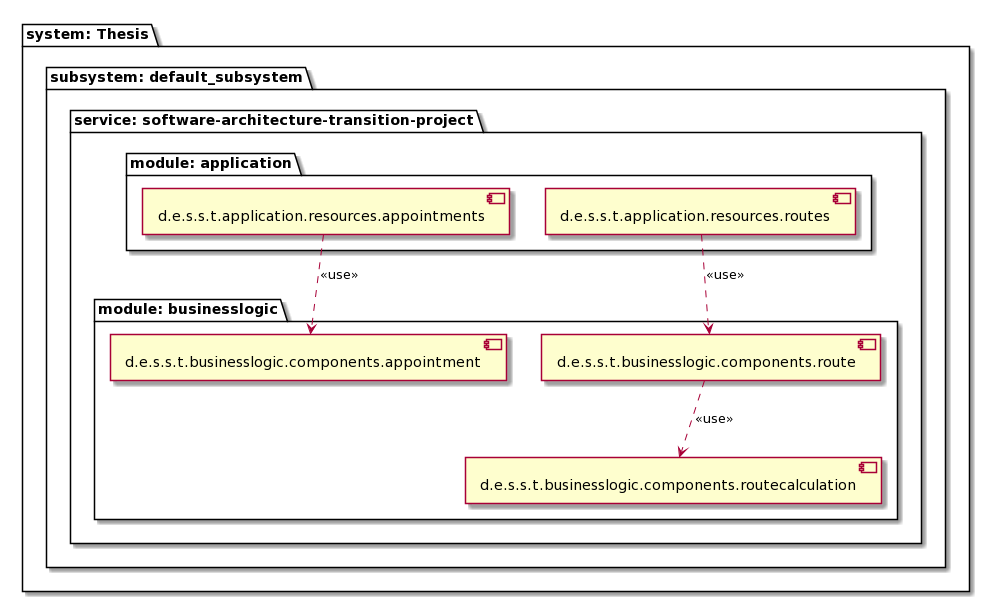
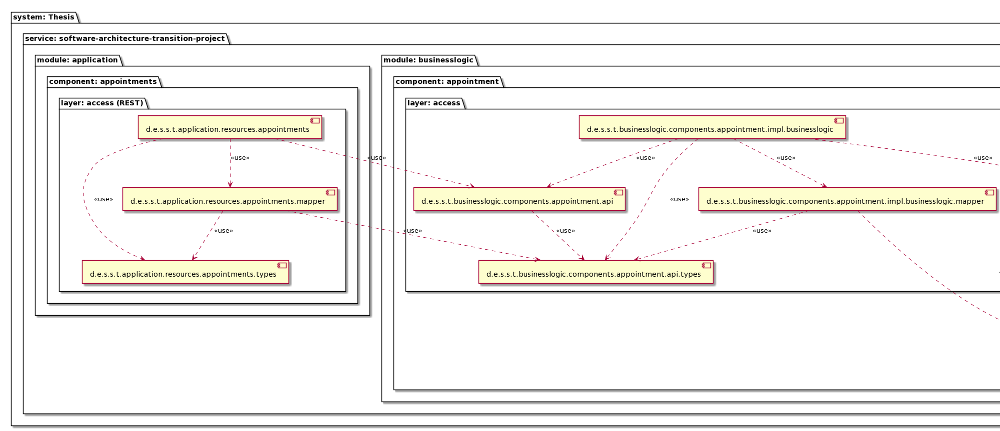
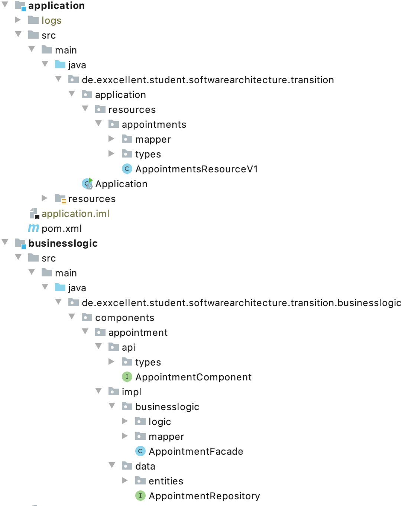

# Eine hybride Software-Architektur für plattformübergreifende Anwendungen

[](https://travis-ci.org/exxcellent/student-software-architecture-transition)

## Fachliches Szenario

### Bauüberwachung durch die Stadtwerke einer Landeshauptstadt.

Das beschriebene Szenario schildert den Prozess der Bauüberwachung, 
die Baustellen an oder in der Nähe der öffentlichen Infrastruktur kontrolliert.
Zur öffentlichen Infrastruktur zählen die Kanalisation, Hydranten, Strom-, Wassser- und Gasleitungen, 
sowie Telekommunikationsverbindungen. 
Die Bauüberwachung soll die Sicherheit der öffentlichen Infrastruktur und 
der Baustellen durch Kontrollen gewährleisten. Absperrungen, Absicherungen und die Tiefbauarbeiten werden geprüft. 
Mängel, Beschädigungen und Ausfälle durch fachgerechte Einweisung vermieden. 

Über eine öffentliche Plattfom können Bauunternehmen über ein Geo-Informationssystem (GIS) Kartenmaterial und 
Pläne der öffentlichen Infrastruktur für bevorstehende Arbeiten abrufen und ihre Baustelle auf der Plattform registrieren.
Mit der Registrierung der Baustelle und einem Ansprechpartner des Bauunternehmens , z.B. dem Bauleiter, startet dieses Szenario.

Das Szenario betrachtet nur den Gut-Fall. Termin-Absagen, Versäumnisse und Sonderfälle werden nicht berücksichtigt.
Die Dokumentation, der gesamte Prozess der Nachbereitung und Terminverschiebungen sind ebenfalls nicht Teil diese Szenarios.

### Planung

#### Vorgang anlegen

Eine bevorstehende **Baustelle** wird durch ein Bauunternehmen auf der Plattform der Stadtwerke registriert. 
Es liegen die Position der Baustelle, eine **Kontaktperson**, ein Zeithorizont und die betroffene Infrastruktur vor.
Vier Wochen vor dem geplanten Zeithorizont einer Baustelle werden die Daten der Registrierung an die Bauüberwachung gemeldet.

Jeder **Inspektor** der Bauüberwachung ist für einen definierten Sektor der Stadt zuständig. 
Über die Position der Baustelle wird sie einem Inspektor zugewiesen. 
Mit dem Daten-Import und der Zuweisung zu einem Inspektor startet ein sogenannter **Vorgang** bei der Bauüberwachung.

#### Termin für einen Vorgang planen

Ein Inspektor startet einen Vorgang, indem er eine **Termin** für den Vorgang anlegt. 
Zum Erstellen eines Termins kontaktiert der Inspektor die Kontaktperson der Baustelle und 
fragt zunächst das konkrete Startdatum an.
Der Beginn von Bauarbeiten kann sich zum Beispiel durch Schlechtwetter, andere Baustellen oder 
fehlendes Material verzögern.

Ist ein Startdatum bekannt, wird je nach **Typ** und **Priorität** der Baustelle
ein Einweisungs- oder Kontrolltermin für einen bestimmten Tag vereinbart.
Der Termin wird einer **Tagesplanung** zugeordnet, in der die Termine für einen Tag und Inspektor gesammelt, 
priorisiert und konkretisiert werden.

Tiefbauarbeiten in direkter Nähe zu Gas-Hochdruck-Leitungen bergen beispielsweise ein hohes Risikopotential. 
Daher besitzen Termine eine bestimmte Priorität, die bei der Bestimmung der Termine für eine Tagesplanung berücksichtigt wird. 

#### Terminanmeldung

Ein bis drei Tage vor Beginn einer Tagesplanung meldet der Inspektor den Termin bei der Kontaktperson an. 
Bei dieser Anmeldung wird das Zeitfenster für den Termin abgestimmt. 
Beispiele für Zeitfenster sind vormittags, zwischen 14 und 16 Uhr oder ab 9 Uhr.
Termine werden pauschal mit 15 Minuten Dauer angesetzt. Ein Maximum von 90 Minuten ist in der Regel ausreichend.
Bei der Vereinbarung der Uhrzeit wird wegen der großen Unsicherheit ein Zeitpuffer eingeplant.

Mit der Bestätigung der Termins durch das Bauunternehmen fertigt der Inspektor die notwendigen Protokolle für den Termin an.
Die Termin-Informationen werden eingetragen und die Protokolle auf Durchschlagpapier ausgedruckt.

#### Tagesplanung abschließen

Mit dem Abschluss der Terminanmeldungen und Vorbereitung der Protokolle wird die Tagesplanung abgeschlossen. 
Sie gilt als vollständig und bereit zur Navigation.

### Navigation

Der Inspektor wechselt in sein Fahrzeug. Die Tagesplanung ist bei Bedarf auf einem Notebook im Fahrzeug abrufbar, 
es verfügt aber nicht über GPS. Daher wird die Navigation und Verwaltung der **Tagesroute** über das Smartphone 
des Inspektors durchgeführt. Für das Smartphone ist eine Halterung im Fahrzeug vorgesehen.

Die Tagesroute enthält die Termine der Tagesplanung mit ihren Zeitfenstern, Positionsangaben und den Kontaktdaten der Ansprechpartner. 
Weitere Informationen zur Routenfindung, wie die Anfahrtzeit sind zusätzlich hinterlegt. 
Ein Termin der Tagesroute wird folgend als **Halt** beschrieben. Halt ist die Kurzform von Haltepunkt.

Es sind auch besondere Haltepunkte, wie der Weg über eine Tankstelle oder die Heimatadresse des Inspektors, möglich.

#### Navigation zum nächsten Halt

Der Inspektor startet die Navigation zum nächsten Halt. Die aktuelle Fahrzeit wird berechnet und die Navigation gestartet.
Mit der bekannten Fahrzeit wird ca. 30 Minuten vor dem Eintreffen auf der Baustelle eine SMS-Benachrichtigung 
an den Ansprechpartner verschickt. 

Der Inspektor hat auch die Möglichkeit die Kontaktperson direkt anzurufen. Diese Option ist insbesondere hilfreich, 
falls die Kontaktperson nicht anzutreffen ist, noch nicht auf der Baustelle eingetroffen ist oder der Termin in die Mittagspause fällt.
In diesen Fällen kann der Inspektor die Reihenfolge der Tagesroute ändern, um weniger Leerlauf zu erzielen.

#### Eintreffen am Halt

Nach dem Eintreffen sucht der Inspektor den Ansprechpartner, z.B. den Bauleiter, um mit ihm das Protokoll abzuarbeiten.
Bei der Begehung der Baustelle werden wichtige Punkte im Protokoll festgehalten. 
Mängel werden zusätzlich fotodokumentiert.

Unterschreiben der Ansprechpartner und der Inspektor das Protokoll, dann gilt der Termin als abgeschlossen. 
Mit dem Abschluss eines Termins beginnt der Prozess mit der "Navigation zu nächsten Halt" erneut,
sofern die Tagesroute nicht abgearbeitet wurde.

### Event Storming

Digitalisierte und reduzierte Ergebnisse des Event Stormings für das Szenario.


### Zusammenhang der fachlichen Entitäten

Ein **Vorgang** wird mit der **Position einer Baustelle**, einem **Kontakt** und einem **Inspektor** angelegt. 
Baustellen und Kontaktpersonen können mehreren Vorgängen zugeordnet sein.

Ein Vorgang besitzt mindestens einen **Termin**, um aktiv zu sein.

Termine werden einer **Tagesplanung** zugeordnet. Die Tagesplanung dient der konkreten Planung der Termin-Abfolge. 
Die Termine werden entsprechend der Priorität, der optimalen Route und weiterer Einflussfaktoren vorsortiert.

Nach dem Abschluss einer Tagesplanung wird diese in eine **Tagesroute** überführt. 
Ein **Halt** auf dieser Tagesroute repräsentiert in der Regel einen Termin. 



Weitere Ressourcen im [resources](./resources) Ordner.

## Infrastruktur

> Vorbedingungen:
>
> Der Docker Deamon muss laufen

### Externe Systeme: Datenbank + Routenberechnungsservice

Führe das `startup.sh` Shell-Script aus, um die PostgeSQL Datenbank und den Routenberechnungsservice(-Mock) zu starten.

```
jdbc:postgresql://localhost:5432/thesis

User: thesis
Password: thesis
Database: thesis
Schema: thesis

Host: localhost (thesis-db)
Port: 5432
```
Die Datenbank wird über `docker` bzw. `docker-compose` bereitgestellt. 
Docker Compose startet den Datenbank Service bei einem Neustart automatisch.
Bei jeder Ausführung von `startup.sh` wird die Datenbank zurückgesetzt.

#### Datenmodel zur Planung




#### Datenmodel zur Navigation




Siehe:
- https://www.docker.com/get-started
- https://docs.docker.com/compose/
- https://www.postgresql.org/docs/12/index.html

#### Routenberechnungsservice

Der Service bietet nur einen (funktionierenden) REST-Endpunkt an: 
`POST http://localhost:5000/optimize?mode=random`

```
{
	"departure_time": "2020-05-09T18:30:00.000Z",
	"locations": [
		{
			"id": 1,
            "_index": 0,
            "lat": 48.118289,
            "lng": 11.641278,
            "duration": 10
		},
		{
			"id": 2,
            "_index": 1,
            "lat": 48.094597,
            "lng": 11.534644,
            "duration": 0
		}
	]
}
```

Die Antwort enthält die `travel_time` zum nächsten Wegpunkt und die Ankunftszeit `eta`.
Über `duration` kann die Termindauer am Wegpunkt definiert werden. 
Die `duration` und die `travel_time` werden addiert, um die `eta` zum nächsten Wegpunkt zu berechnen.

```
{
  "departure_time": "2020-05-09T18:30:00.000Z",
  "locations": [
    {
      "_index": 0,
      "duration": 10,
      "eta": "2020-05-09T18:30:00.000Z",
      "id": 1,
      "lat": 48.118289,
      "lng": 11.641278,
      "travel_time": 11.1
    },
    {
      "_index": 1,
      "duration": 0,
      "eta": "2020-05-09T18:51:06.000Z",
      "id": 2,
      "lat": 48.094597,
      "lng": 11.534644
    }
  ],
  "travel_time": 11.1
}
```

### Client

Führe folgende Befehle aus, um die Angular SPA zu starten:

```
$ npm install

$ npm run start
```

Öffne [http://localhost:4200](http://localhost:4200) mit einem modernen Browser. Das Projekt nutzt
[CSS Variables](https://caniuse.com/#search=css%20variables) und der Internet Explorer unterstützt diese Funktion nicht.

Per [http://localhost:4200/?mode=desktop](http://localhost:4200/?mode=desktop) öffnet sich eine Desktop-Ansicht.




### Server

Führe `sh ./startServer.sh` aus, um den Spring Boot Server zu starten.
Der Server läuft unter `http://localhost:9000/`

Zum Zugriff auf die API existiert eine [Postman Collection](./resources/student-software-architecture-transition.postman_collection.json).
Als Alternative kann die API auch direkt über die [Swagger UI](`http://localhost:9000/swagger-ui/index.html`) bedient werden.
Bei Explore folgenden Link eingeben: `/api-docs`.

#### Schichtenarchitektur

Hier ein paar generierte Diagramme zur Bausteinsicht. 

Modul-Übersicht


Komponenten-Diagramm für _Appointment (Termin)_ und die Sub-Domäne "Navigation" mit ihrer _Route_ Komponente


Innensicht für Appointment mit den Bestandteilen aus jeder Schicht innerhalb der Komponente


für folgende Package-Struktur:




Siehe:
- https://maven.apache.org/guides/index.html
- https://docs.spring.io/spring-boot/docs/2.2.6.RELEASE/maven-plugin/

